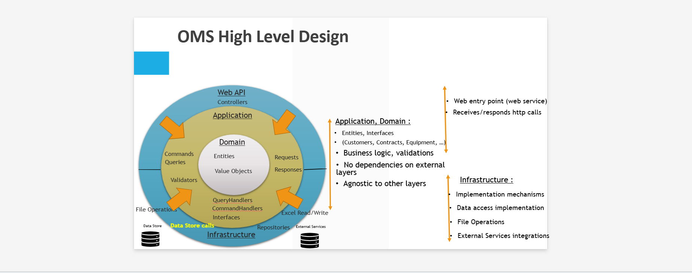

# ADR-01: Use of Clean Architecture

## Context
The Order Management System (OMS) has complex business rules and must support clear separation of concerns, extensibility and testability across multiple layers.

## Decision
We adopt Clean Architecture along with CQRS (Command/Query Responsibility Segregation) and DDD (Domain Driven Design) to organize the system into the followng main layers:
- **Domain Layer**: Models the domain and contains the pure business logic.
- **Application Layer**: Contains use cases and interfaces. Orchestrates domain behavior.
- **Infrastructure Layer**: Implements technical details (persistence, file system and external services).
- **API Layer**: Exposes HTTP endpoints.

This approach supports Dependency Inversion: the outer layers depend on interfaces in the inner layers. For example, all the implementions in the **Infrastructure Layer** follow the contracts (interfaces) which rely in the **Application Layer**. 

## CQRS (Command/Query Responsibility Segregation)
**CQRS** splits read and write models at an architectural level
- **Commands**: Modify state of the system.
- **Queries**: Retrieve state of the system without modifications.
- **Handlers**: Encapsulate use case logic.

Main Benefits :
- Maintainability (layers make code easier to test, refactor, and evolve) 
- Testability (domain logic and use cases are isolated and unit-testable), 
- Read Optimization (allows fast, tailored read models)
- Clear Intent (commands express behavior clearly while queries simplify reads)
- Scalability (enables scaling reads independently)

 ## Domain-Driven Design (DDD) 
**DDD** models the solution around the core domain and its language, capturing complex domain rules

Main Concepts :
- Entity: Has identity and lifecycle (e.g., Order, Customer).
- Value Object: Immutable, value-based (e.g., Email, Address).
- Aggregate Root: Entry point to modify an aggregate (e.g., Order includes OrderItems).
- Domain Events: Capture side effects (OrderShippedEvent, PaymentFailedEvent).
- Repositories: Interfaces abstracting persistence for aggregates.
- Specifications: Encapsulate business rules as reusable predicates.

## Clean Architecture Overview

## Consequences
- **Pros**:
  - Models the complex OMS domain with clarity.
  - Clean boundaries help collaboration and scaling
  - Responsibilities are clearly separated, simplifying among others collaboration.
  - CQRS lets you scale reads and optimize projections
  - The system is testable at every level without infrastructure dependencies.
  

- **Trade-offs**:
  - There's a slight initial overhead in structuring projects, but it pays off in maintainability.
  - Requires understanding of many concepts like DDD patterns, CQRS mechanics and architectural principles.
  - Commands, queries, events, mapping – may lead to duplication if not managed well.
  - New devs may initially struggle to follow logic due to indirectness and strict boundaries.